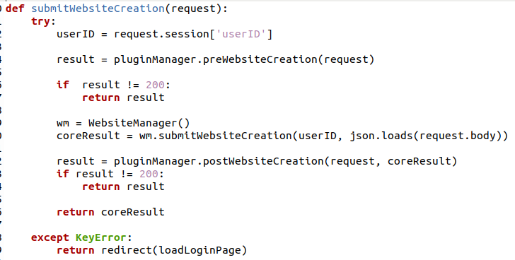
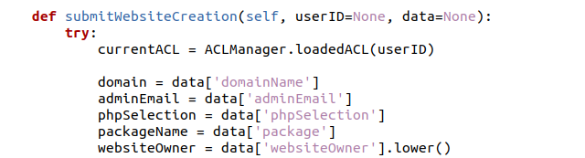
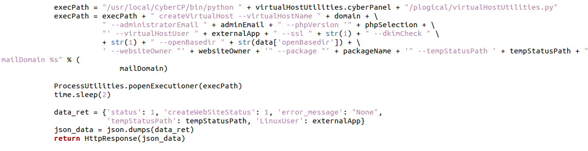
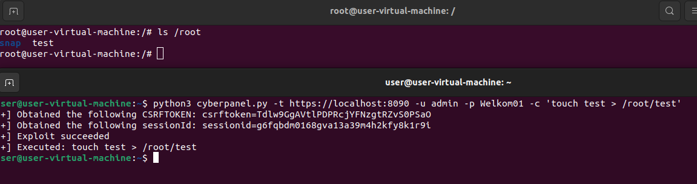

# CVE-2024-53376

>CyberPanel是一个开源的Web控制面板，它提供了一个用户友好的界面，用于管理网站、电子邮件、数据库、FTP账户等。

CyberPanel Authenticated OS Command Injection

## 来源

[https://github.com/ThottySploity/CVE-2024-53376](https://github.com/ThottySploity/CVE-2024-53376)

## 简介

CyberPanel的/websites/submitWebsiteCreation接口存在命令执行漏洞，经过授权的攻击者可以通过此接口执行任意命令获取服务器权限，从而造成数据泄露、服务器被接管等严重的后果。

## 影响范围

-   CyberPanel < 2.3.8

## 漏洞类型

命令执行

## Affected Devices

CyberPanel versions < 2.3.8 are vulnerable to an OS command injection. To exploit the vulnerability the attacker is required to firstly login to the webpanel. 

## Tested With
CyberPanel 2.3.7

## Technical details

An attacker can use a HTTP OPTIONS request to instruct the webserver running the CyberPanel application to execute arbitrary commands. This vulnerability lies in the /websites/submitWebsiteCreation endpoint.

This endpoint calls the submitWebsiteCreation function in the /websiteFunctions/views.py file location. 

This function further calls the `wm.submitWebsiteCreation` function found in the /websiteFunctions/website.py file. This function extracts five parameters which are used within the function:
    - domain;
    - adminEmail;
    - phpSelection;
    - packageName;
    - websiteOwner;

These parameters are later parsed directly to a function that executes these:

The Proof-of-Concept (PoC) code can be found in the cyberpanel.py file that is linked in this repo.

## PoC

This Proof-of-Concept can be used to write files with root level permissions, anywhere on the system:

This could result in a complete device compromise. If the device's CyberPanel installation folder is accessible, data can be more easily extracted through the web panel.

## Writeup 

The writeup which outlines the discovery process of the exploit will become available at: https://thottysploity.github.io/posts/cve-2024-53376

## Timeline

30.10.2024 - Identified vulnerability  
31.10.2024 - Contacted Usman Nasir, owner of CyberPanel  
02.11.2024 - Usman fixed the issue and published a fix  
03.11.2024 - Requested CVE-ID from MITRE  
23.11.2024 - MITRE reserved CVE-ID 2024-53376  